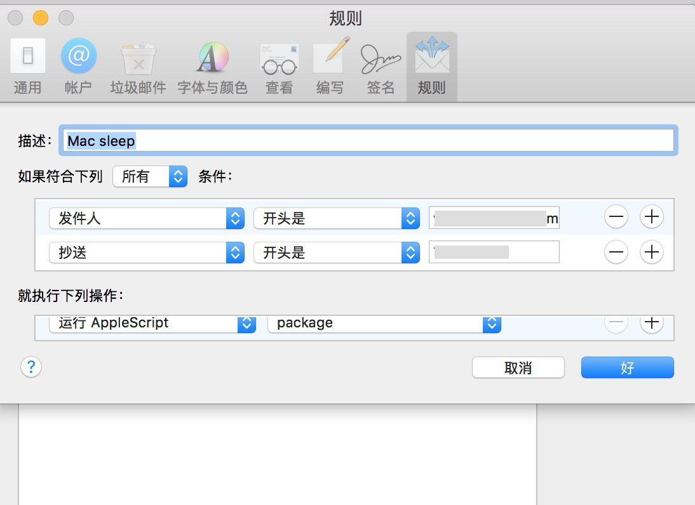
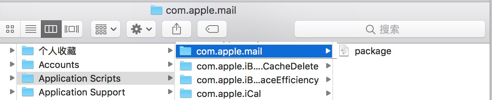
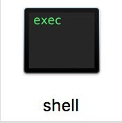
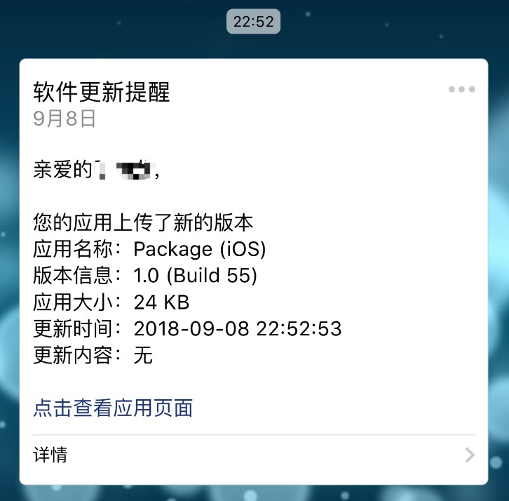

## 手机远程控制Mac实现iOS APP一键打包上传

听起来有点**ridiculous**哈~

需要解决两个问题：
> * 手机怎么就能控制电脑（这里指的Mac）
> * 怎么打包并上传

### 问题一：手机控制Mac电脑

#### AppleScript
有好多办法是可以控制电脑执行一定的操作，这里先用邮件举个栗子……

Mac自带的邮件可以触发一定的操作，可以预定义一个脚本，通过接受到的邮件，触发预定义的脚本。这里的脚本只支持**AppleScript**，**AppleScript**是个什么鬼？


面熟吧，就是不咋用，在里面敲个命令

```
tell application "System Events" to sleep
```
执行一下，屏幕黑了吧！

#### 邮件触发脚本

在接收到邮件的时候，可以设定一个动作，比如就要出发上面的一个脚本，我们可以先保存好这个脚本，一会儿用到。先看看邮件偏好设置，如何设置，见下图：



几个设置比较容易看懂，收到邮件满足条件则**运行AppleScript**，后面的package，就是刚才保存的脚本。脚本需要添加的一定的位置才可以被执行，点击package一行的时候会让你在 **Finder** 中显示如下：



放到这个 **com.apple.mail** 文件夹下！好了，试着按照自己设定的**规则** 发个邮件试试，看看脚本会不会执行。

### 问题二：打包与上传的脚本
如果执行了，那666。往后的动作应该不陌生了，搞过持续集成的应该对**打包**和**上传**的脚本不陌生了，一键无痛打包，想必你干过；没做过的也无妨，脚本拿去不谢。最基本的流程如下：


#### 代码获取
这个就不说了，相信git或者svn的命令你比我熟多了，扔进脚本里就好。

#### Archive + Export
都是用的xcodebuild命令，具体怎么写看下面的。

#### 上传
**Linux** 命令上传，具体写法看服务器定义，我找了个蒲公英的上传样式。

打包脚本的编写，声明一下啊：

```
真正有用的命令只有两行，其中需要处理的东西比较多，
大神们写的都很多，包括一些容错。
我只写了最基本可以快速使用的部分
如果需要更多的使用方式，稍后找到链接会给大家贴上去
```
给大神博客打个广告，参考如下：
[Jenkins+github+fir持续集成iOS项目](https://wangjianjun0730.github.io/2017/10/Jenkins/)

创建一个文件 `touch shell`, 粘贴如下代码并保存

```
#!/bin/sh -
export LANG=en_US.UTF-8

# 工程名，你项目叫啥名字
APP_NAME="Package"

# TARGET名称，需要打包的TARGET
TARGET_NAME="Package"

# 工程根目录
CODE_PATH=".xcodeproj 所在的目录"

# 证书
# 证书名字的获取后面说
CODE_SIGN_DISTRIBUTION="iPhone Distribution: Zuiye Company Limited"

# archive路径、导出的ipa路径、需要的ExportOptions.plist路径可以随便定义，路径里包含有之前定义的变量的时候，写法如下：
# "${路径变量名}/${APP名}.ipa"


# 删除工程文件
echo "+++++++++删除工程文件+++++++++"
rm -rf "${TARGET_NAME}.xcarchive"

# 进入工程源码根目录
cd "${CODE_PATH}"

# 清除工程
echo "=================clean================="
xcodebuild -project "${APP_NAME}.xcodeproj" -scheme "${TARGET_NAME}" -configuration 'Release' clean

#将app打包成xcarchive格式文件（PROVISIONING_PROFILE后面是你配置的证书对应的描述文件UUID，获取方式后面谈到）
echo "+++++++++++++++++archive+++++++++++++++++"
xcodebuild  archive -project "${APP_NAME}.xcodeproj" -scheme "${TARGET_NAME}" -archivePath "${TARGET_NAME}.xcarchive" -configuration 'Release' PROVISIONING_PROFILE='后面讲述怎么获取' CODE_SIGN_IDENTITY="${CODE_SIGN_DISTRIBUTION}"

# 将xcarchive格式文件打包成ipa
echo "+++++++++++++++++ipa+++++++++++++++++"
xcodebuild -exportArchive -archivePath "${CODE_PATH}/${TARGET_NAME}.xcarchive" -exportPath "${CODE_PATH}" -exportOptionsPlist "${CODE_PATH}/ExportOptions.plist"

# 上传蒲公英
echo "=================开始上传================="
curl -F 'file=@'${CODE_PATH}/${APP_NAME}.ipa'' -F '_api_key= 自己蒲公英帐户的_api_key' https://www.pgyer.com/apiv2/app/upload

```
保存完成后只是一个普通的文本文件，转换成可执行程序需要通过 `chmod` 命令给权限

```
chmod +x  给权限
chmod -x 去除执行权限
```
在脚本目录下执行

```
chmod +x shell
```

得到可执行文件如下：



有三个参数需要获取  `PROVISIONING_PROFILE ` 、`CODE_SIGN_DISTRIBUTION `、`exportOptionsPlist `

#### PROVISIONING_PROFILE获取
比如你项目已经配置好了，也可以打包，那么找到    `.xcodeproj` -->   `显示包内容`-> `打开project.pbxproj(双击)`--> `搜索下PROVISIONING_PROFILE` 就看到了。

#### CODE_SIGN_DISTRIBUTION获取
打开钥匙串，找到根证书，查看下详情，有个类似于 `iPhone Distribution: Zuiye Company Limited` 这样的名字，有的后面还会有个小括号，都需要复制过来。

#### exportOptionsPlist获取
可以自己写，但是有个最好的方式就是先用xcode打包一次，然后就看到这个`ExportOptions.plist` 了，跟 `ipa` 文件在一起。

***

现在能控制电脑了，打包脚本也可以自动打包上传了，然后把两件事情合并到一起，就是在邮件执行的那个脚本里调用以下这个打包脚本，如下：

```
do shell script "打包脚本的路径"
```
给你的Mac电脑发了个邮件，然后电脑执行打包脚本并上传APP，没完事呢，缺啥呢？缺了个通知，我不知道有没有发布成功啊。不要着急，可以让服务器给你发消息。以蒲公英为例，发布成功一个APP，微信公众号可以收到消息，如下：



然后呢，不知道啊~

还有，脚本后面加个关机的命令，不干活就让电脑休息吧~

还有，给电脑开个用户，就干这个事，因为电脑里太乱了，不想别人看到~

还有，今天大腿有点拉伤了，一字马没下到底。手还能能动，熬夜写了这篇小破文章~

困了，明天再校对吧~
